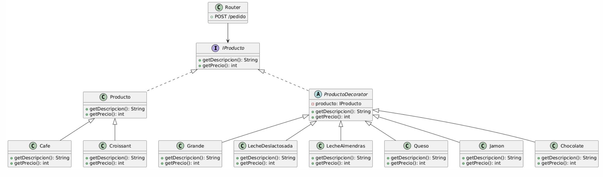

# Implementación del Patrón Decorator

## Descripción del Patrón
El patrón **Decorator** es utilizado para **añadir funcionalidad a objetos de manera dinámica sin modificar su estructura base**. Este proyecto demuestra su implementación mediante un ejemplo práctico en **JavaScript** utilizando **Express.js** para la gestión de pedidos en una cafetería.

## Estructura del Proyecto
La estructura del proyecto sigue una organización modular:

```
nombre-del-proyecto/
│
├── src/
│   ├── cafeteria/
│   │   ├── interfaces/        # Definición de interfaces como IProducto
│   │   ├── models/            # Clases base de productos (Producto, Cafe, Croissant)
│   │   ├── decorators/        # Implementaciones del Patrón Decorator (Chocolate, LecheDeslactosada, Grande, etc.)
│   ├── pedidos/               # Definición de rutas API
├── uml/                       # Carpeta con los diagramas UML
├── README.md                  # Documentación del proyecto
├── package.json               # Archivo de configuración de Node.js
```

## Dependencias Utilizadas
Este proyecto utiliza las siguientes dependencias definidas en `package.json`:

```json
{
  "dependencies": {
    "express": "^4.18.2"
  }
}
```

## Instrucciones de Instalación
1. **Clonar el repositorio:**
   ```sh
   git clone https://github.com/Arqui-de-Software/Back.git
   cd Back
   ```

2. **Instalar dependencias:**
   ```sh
   npm install
   ```

3. **Ejecutar el proyecto:**
   ```sh
   node src/server.js
   ```

## Ejemplo de Ejecución
Al realizar una petición `POST` al endpoint de pedidos con el siguiente JSON:
```json
{
  "producto": "cafe",
  "extras": ["chocolate", "lecheDeslactosada"]
}
```
La salida esperada es:
```json
{
  "descripcion": "Café, con chocolate, con leche deslactosada",
  "precio": "$7000"
}
```

## Diagrama UML
El siguiente diagrama muestra la estructura del Patrón Decorator implementado:


## Explicación de la Implementación
El patrón **Decorator** ha sido implementado utilizando las siguientes clases principales:

- **`IProducto`**: Define la interfaz común para todos los productos.
- **`Producto`**: Clase base que representa un producto genérico.
- **`Cafe` y `Croissant`**: Productos concretos que extienden de `Producto`.
- **`ProductoDecorator`**: Decorador abstracto que envuelve a un `Producto` y delega sus métodos.
- **Decoradores concretos (`Chocolate`, `LecheDeslactosada`, `Grande`, etc.)**: Modifican dinámicamente las características del producto base.
- **`router.pedidos`**: Módulo que recibe solicitudes HTTP y aplica decoradores en tiempo de ejecución.

## Frontend del Proyecto
El frontend de la aplicación está desarrollado con **React**, permitiendo una interfaz dinámica e interactiva para la gestión de pedidos en la cafetería. El código fuente del frontend está disponible en el siguiente repositorio:

[Frontend Repository](https://github.com/Arqui-de-Software/Front.git)


## Contribuciones
Este proyecto fue desarrollado por:
- Rita trindade da Cruz
- Juan Andrés Gómez Pérez
- Brandon Eduardo Merchan

